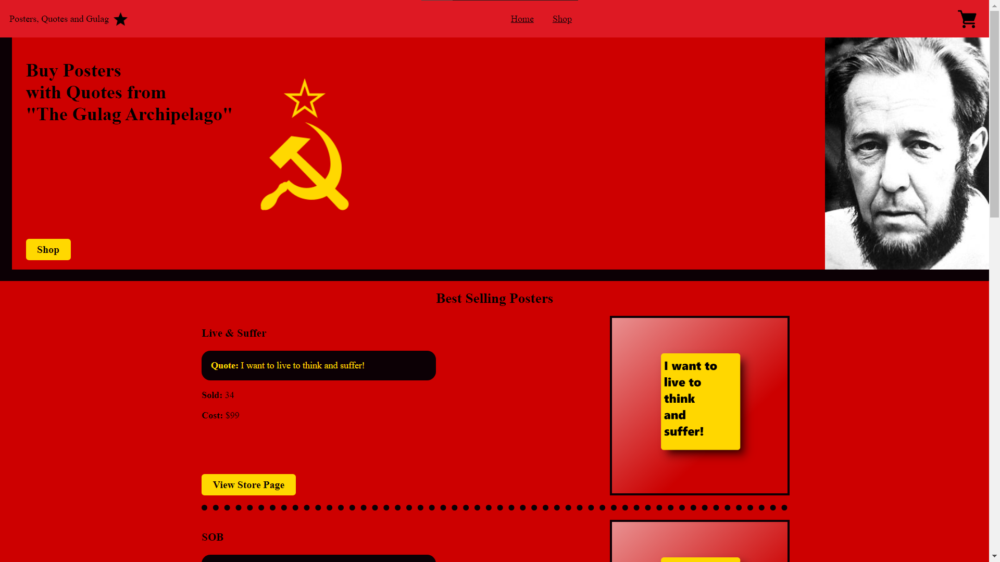
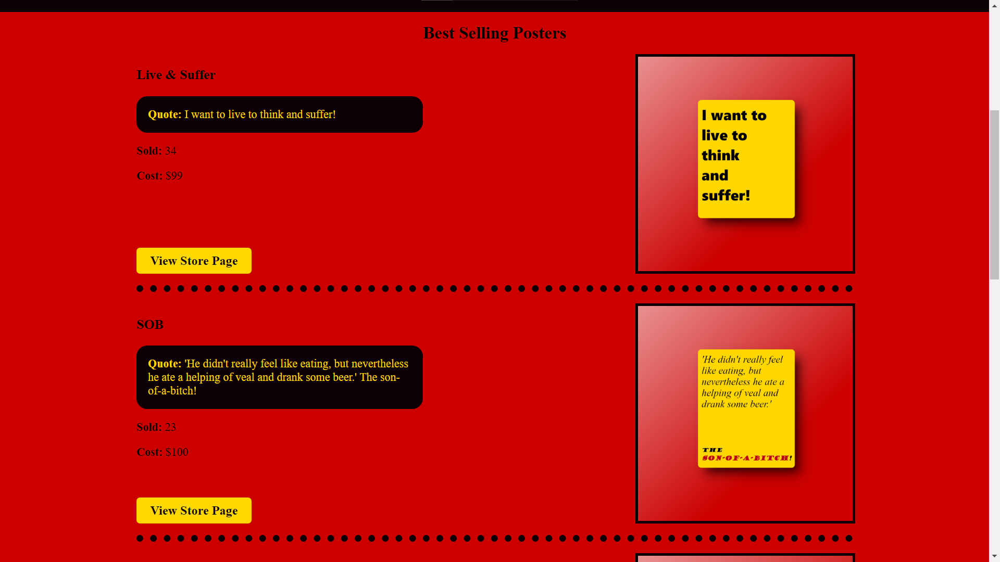
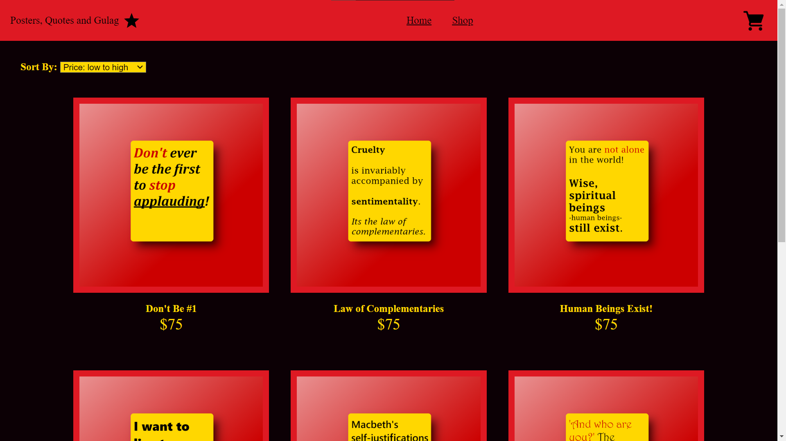
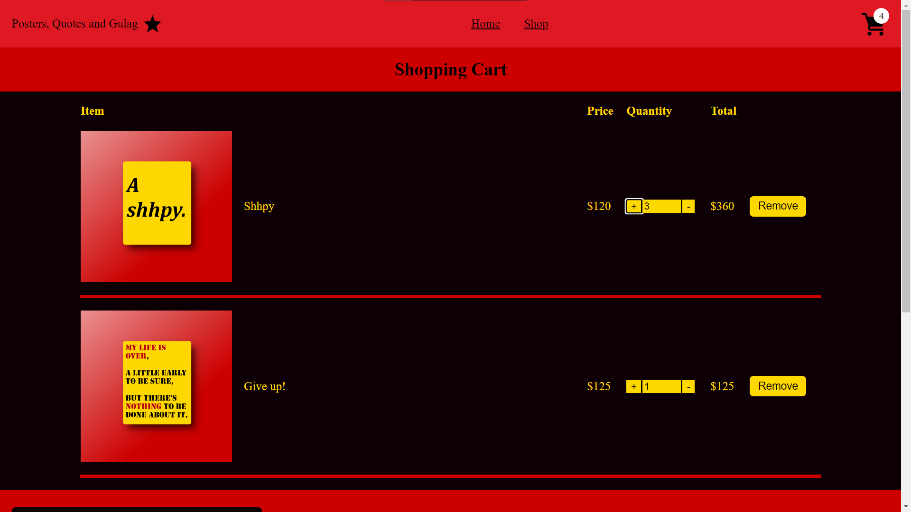

# Shopping Cart (eCommerce website)

What is this project? It is a fake SPA eCommerce website (front-end only). The fake store sells posters with quotes from 'The Gulag Archipelago'. I made this project to practice my React and programming skills.

**Live demo [link](https://posters-quotes-gulag.netlify.app/)**. 👈

### Technology Used
- React
- React Router
- Vite
- Netlify
- JavaScript
- HTML/CSS

# Screenshots

# Commands
To start up the local development server: `npm run dev`

To build the project: `npm run build`

To format the code: `npm run format`
